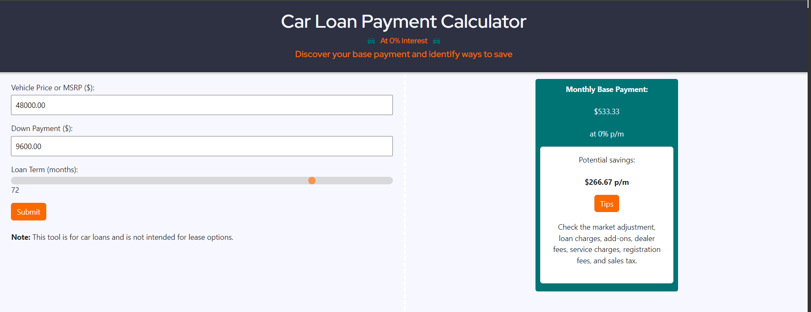

# Car Loan Payment Calculator

## Description

This project enables car buyers to save on their purchase. It determines the monthly base payment based on the vehicle price or MSRP, down payment, and loan term at 0% interest and with no additional markup. The monthly base payment provides an objective starting point to compare with a third-party quote. The application calculates the monthly base payment and subtracts the third-party quote in order to determine potential savings. The user is provided with tips to identify additional costs (i.e. market-adjustment, loan charges, add-ons, dealer fees, service charges, registration fees, and sales tax), enabling the user to make a more informed purchase decision.

## Features

- Calculate monthly car loan payments at 0% interest without additional markup.
- Compare the calculated payment with a third-party quote.
- Discover potential monthly savings.
- Find suggestions for understanding additional costs.

## Usage

1. Load the webpage.
2. Enter the following details:

- Vehicle Price or MSRP ($)
- Down Payment ($)
- Loan Term (months)

3. Click the "Submit" button.
4. Enter a monthly-payment quote from a third-party (optional).
5. View the monthly base payment and potential savings.
6. Click "Tips" button for suggestions to better understand potential charges.

### Example

If the user enters a vehicle price of $48,000, a down payment of $9,600, and a loan term of 72 months, a monthly base payment of $533.33 will be displayed. If a third-party quote was entered, the difference between the third party quote and the base monthly payment will be shown, indicating potential savings. Suggestions for identifying additional costs are indicated.

## Screenshot

## Deploy Link

https://b3hold23.github.io/car-loan-payment/

## Credits

Collaborators:

Jaron Anderton:  
Rory Dowse: [github.com/RoryDowse](https://github.com/RoryDowse)  
Angel Fernandez:

## License

This project is licensed under the MIT License.
